<h1 align="center">Konichiwa, I'm Simon Pradhananga 👋</h1>

  

<!--
- 🔭 I'm currently working on Jyami POS (React Native) and a Next.js restaurant ordering platform
- 🌱 I'm currently leveling up in Electron.js, NestJS, and PostgreSQL
- 👯 I'm looking to collaborate on real-time systems, POS/printing infra, and full-stack TypeScript projects
- 🤔 I'm looking for help with scaling multi-tenant architectures
- 💬 Ask me about React Native, Next.js, ESC/POS printing, or full-stack TypeScript
- 📫 How to reach me: simon234pradhan@gmail.com
- 😄 Pronouns: He/Him
- ⚡ Fun fact: I once debugged a printer bug that came down to a single missing `try/finally`
-->

 

## About Me

I'm a full-stack developer working across **mobile, web, and desktop**. My recent focus has been building real-time, production-grade systems — from a **React Native POS app**, **Next.js restaurant ordering platform** with server-side permission handling.I'm the kind of person who tinkers for fun — I've built local streaming setups just to see if I could, and I'm always picking up something new, whether that's a framework or, this term, the fundamentals of finance and marketing analytics from my coursework. I like that mix: building things and understanding the systems (technical or otherwise) around them.

Always open to interesting problems, good collaborators, and conversations about anything from ESC/POS printer quirks to whatever I'm currently down a rabbit hole with. I like untangling gnarly bugs as much as building new features.

 

## Skills

### Languages

  &nbsp;&nbsp;&nbsp;&nbsp;
  &nbsp;&nbsp;&nbsp;&nbsp;
  &nbsp;&nbsp;&nbsp;&nbsp;
  &nbsp;&nbsp;&nbsp;&nbsp;
  &nbsp;&nbsp;&nbsp;&nbsp;

### Frameworks & Libraries

  &nbsp;&nbsp;&nbsp;&nbsp;
  &nbsp;&nbsp;&nbsp;&nbsp;
  &nbsp;&nbsp;&nbsp;&nbsp;
  &nbsp;&nbsp;&nbsp;&nbsp;
  &nbsp;&nbsp;&nbsp;&nbsp;
  &nbsp;&nbsp;&nbsp;&nbsp;

### Databases & Tools

  &nbsp;&nbsp;&nbsp;&nbsp;
  &nbsp;&nbsp;&nbsp;&nbsp;
  &nbsp;&nbsp;&nbsp;&nbsp;
  &nbsp;&nbsp;&nbsp;&nbsp;

 

## GitHub Stats

  
  

 

## Connect With Me

  
  
  

 

  

